#Using CartoDB and Odyssey.js for Making Story Maps
This tutorial has been written so that it is generic enough for anyone to easily create a story map using a free CartoDB account and Odyssey.js. The tutorial is written specifically to support a course at Stanford University, but is being made publicly available for the benefit of all. We like the [FOSS4G](https://2015.foss4g-na.org/) ethos, here, and try to live it. 

I'll be maching up information from various sources ([Wikipedia](http://www.wikipedia.org), etc...) on the modern history of tattooing in San Francisco. Mostly because it's interesting, and there is plenty of material that is cool to look at. That said, I'm not a historian and this is not an authoritative map of that history (now that I think of it, that would be cool though). It's a tutorial on how to make a Story Map from CartoDB and Odyseey.js. 

###In This Tutorial, You Will Learn To:

* Create an empty CartoDB table
* Populate that table with fields for your data
* Add the data to your new empty table
* **'Geocode'** your records so that they show up on the map
* Customize the **Pop-up** and **Hover** doo-dads
* Find your Map ID to put into Odyssey.js
* Use the Odyssey.js 'Sandbox' to create a basic Story Map
* Use an historic map from DavidRumsey.com as a basemap in your Story Map
* Share your Odyssey.js Story Map with a URL, Embed Code, or host it yourself.

###What You Will Need Before Getting Started
* Something interesting to make a Story Map of!
* Information about the locations that make up your story
 * The **Latitude & Longitude** of your locations (Go to [Google Maps](http://maps.google.com), find your location, **right-click** on it and select **What's Here**. You can *cut-&-paste** the coordinates from the resulting info window)

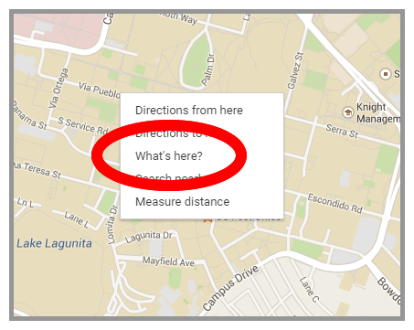  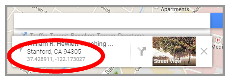
 * Links (URLs) to images
 * Links (URLs) to more content
 * Narrative text about your subject
 * etc...
* A **CartoDB account**. You can get a free one, here: [CartoDB Free Account](https://cartodb.com/signup). If you have an **.edu** email address, you can get a slightly better one, here: [CartoDB Aademy Account](https://cartodb.com/signup?plan=academy)

###It Would Be Incredibly Helpful if You...
* Go through the following [CartoDB Academy courses:](http:/academy.cartodb.com/) 
 * [Online Mapping for Beginners](http://academy.cartodb.com/courses/01-beginners-course.html#) - Basic concepts of online mapping
 * [Introduction to Map Design](http://academy.cartodb.com/courses/02-design-for-beginners.html) - Master the basics of designing data for your maps!
* Learn more about [MarkDown](http://daringfireball.net/projects/markdown/), which is the text /ing 'language' you will use to create the content in your Odyssey.js Story Map (It's also what this tutorial is written in!).
* Take a look at these pages from the w3schools.com:
 * [HTML img Tag](http://www.w3schools.com/tags/tag_img.asp) - We'll use this to turn our image URL into the image in our pop-ups
 * [HTML a Tag](http://www.w3schools.com/tags/tag_a.asp) - We'll use this to turn our Link URLs into actual links in our pop-ups

##Getting Started with CartoDB
* Login to your CartoDB Account (if you don't have one, see above).

###Create an Empty Map/Dataset
* Click on the **New Map** Button.


* Click on the **Create New Map** button


* Click on your **untitled_map** to highlight it and then click the **Create Empty Map** link at the top right of the page

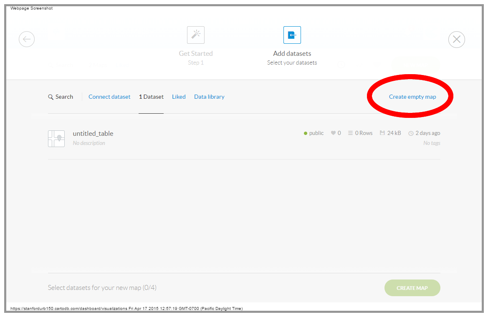

* Click on yet another **Create Map** button...

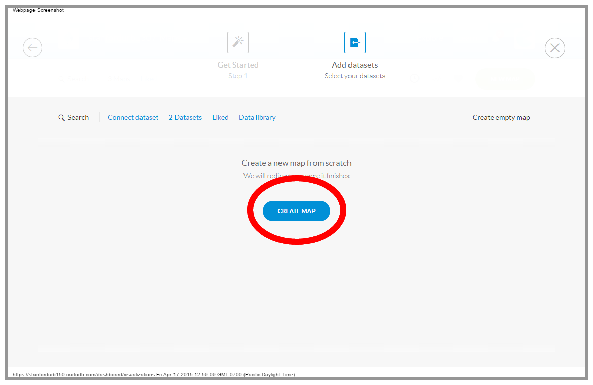

###Adding Fields to an Empty CartoDB Table
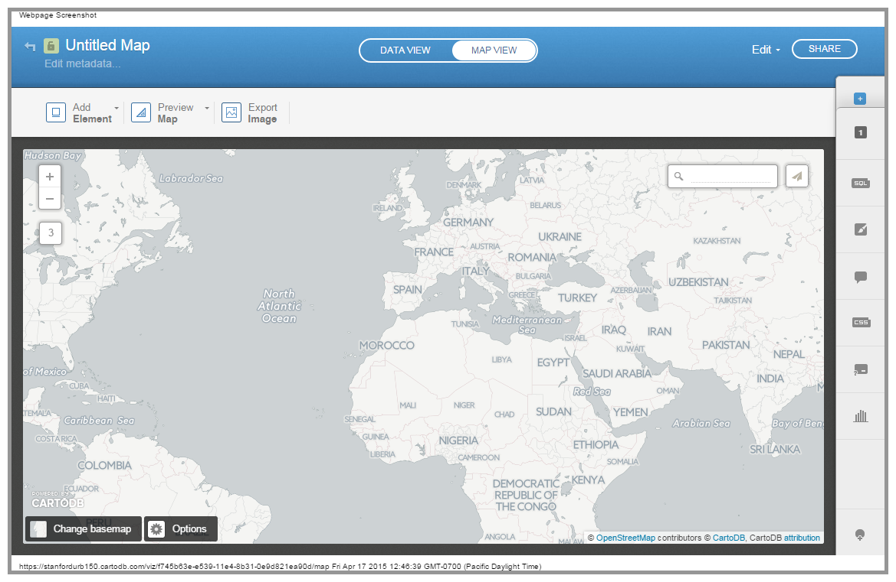
You should now see something like the image, above, with a basic CartoDB Basemap and the tools you need to begin building your map. You should have already gone through the CartoDB Academy Basic courses, so we won't go through all of the details, now. We're going to get right to work creating fields to hold our content. Let's get started...

* Click on the **Data View** button at the top of the page...

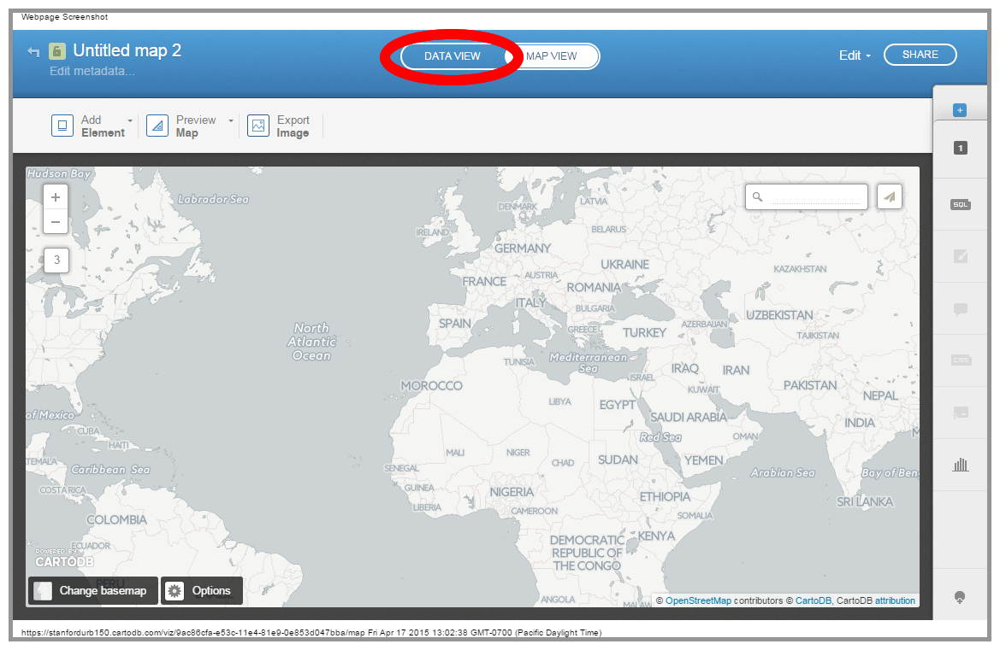

* CartoDB will tell you to start adding rows, but we're not ready for that, yet. First, we want to add some columns to hold the content we want in our pop-ups and hoveer actions. Click on the **Add Columns** button, instead...


* Our blank table already has **description** and **name** fields, so we don't need to add those. We *do* want to add images to our pop-ups, as well as links our image sources and maybe even links to other websites with more information on the subject of the points we input. Let's add columns for those...

Add the following columns using the **Add new column** dialog box (just click the **Add Column** button again for each one):
* **'img_url1'** with a type of **'string'** (this will hold the URL for the image you want to show up in your pop-up)
* **'img_url1_src'** with a type of **'string'** (to hold the URL of the website you got the image from)
 * If you want more than one image per pop-up, just add more sets of **'img_url#'** and **'img_url#_src'** columns, iterating the number (not too many, though, you'll be able to insert images into the narrative text of your Odyssey.js Story Map)
* **'link_url1'** with a type of **'string'** (This will hold a URL to link out to other sources of information)
 * Again, if you want more links, just iterate the **'link_url#'** column
* **'latitude'** with a type of **'number'**
* **'longitude'** with a type of **'number'**

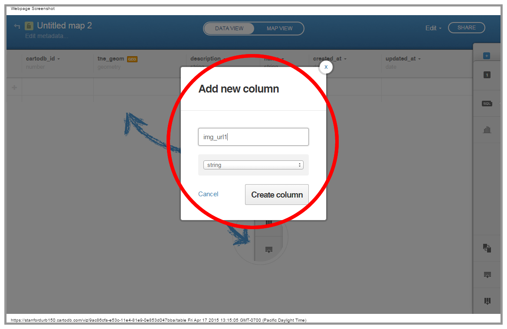

##Entering Your Data!
Now it's time to start putting some content into your CartoDB table. Hopefully, you've already assembled the materials you need and can simply begin to **cut-&-paste** that data into your table.

* First, click on either of the **Add Row** buttons at the left side of the first empty row, or at the bottom right of the table, right above the **Add Column** button.

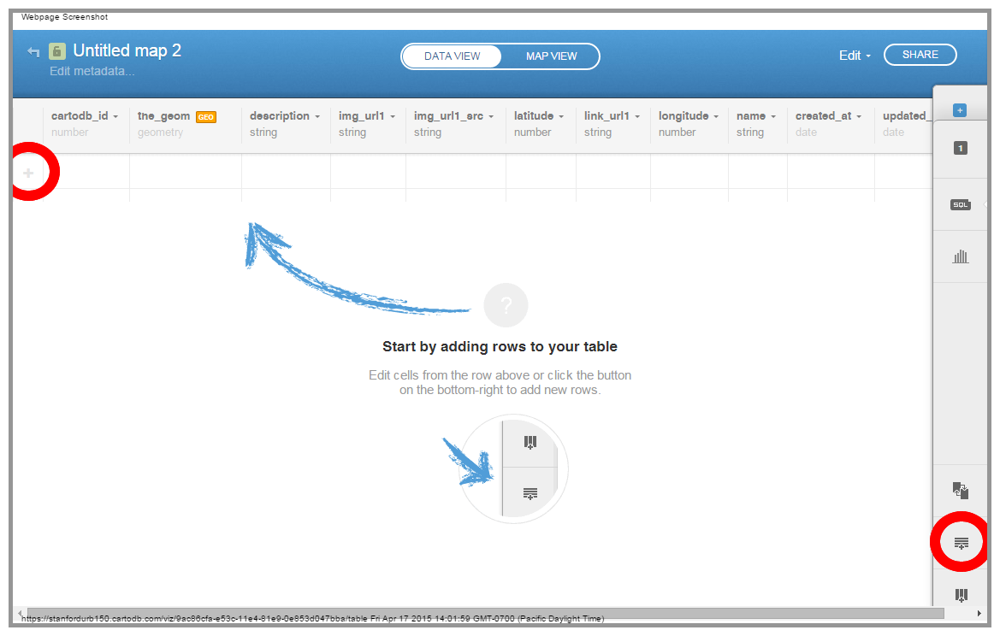

* Now simply **double-click** in the **cell** you want to / and **cut-&-paste** the data for your locations into the table.


**Now all you need to do is repeat the process for all of your locations!**

###Geocoding Your Locations (making them show up on the map)
Once you have finished entering all of your data, you need to tell CartoDB that your **'latitude'** & **'longitude'** fields contain the geographic information about your locations. This will create **geometry** data in the default column, **'the-geom'**.
* Click on the orange **GEO** button, to the right of the name of the **'the_geom'** column

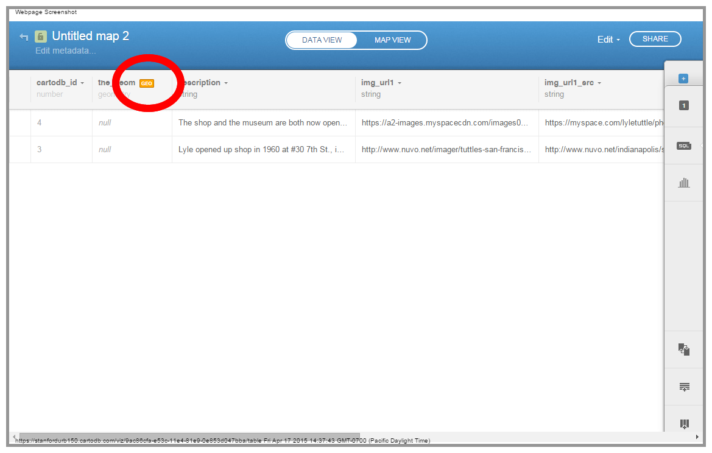

* CartoDB should guess that your coordinate columns are called **'longitude'** & **'latitude'**
* Click **Continue**

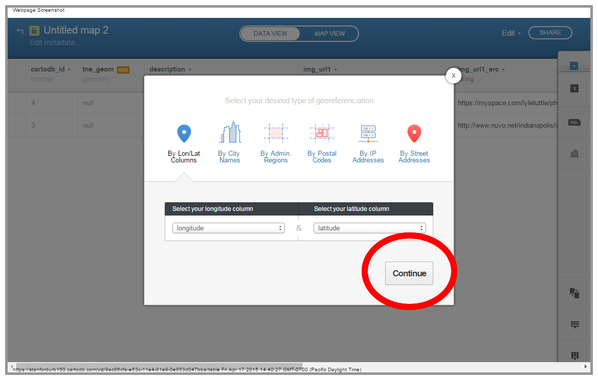

>You may have noticed that we could have simply placed **street addresses** into our table and **'geocoded'** our data that way. We used **coordinate** for two reasons:
>* First, **geocoding street addresses** in CartoDB comes with a quota, **geocoding** with **coordinates** doesn't...
>* Second, we're mapping historical locations/addresses that might not necessarily be the same, now, as they were, historically. Streets change names, disappear and are created through time.

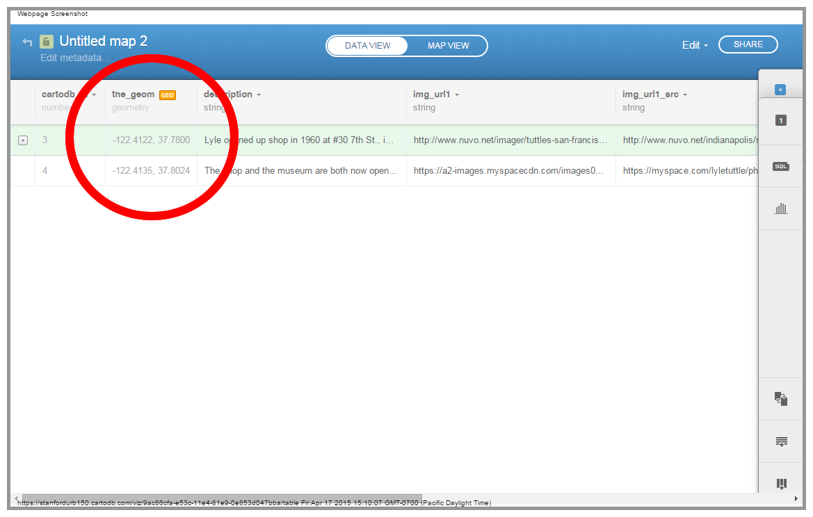

* That's it! You should see your coordinates in the **'the_geom'** column, now!
* Click on the **MAP VIEW** button at the top and center of the page to see your locations appear on the map.


Ok. You've got a CartoDB map, now. We're not going to go into creating custom symbols, etc... since you can just go the the **CartoDB Academy** page (see the top of this page) and get all of that. We're just going to stick with the default symbol for this tutorial.

###Customizing the Click & Hover Pop-ups

Now we want to do a little culstomization of the pop-ups that will appear when you click or hover on the points in your map. Notice that, right now, nothing happens when you hover over a point, and you get a message that ***"You haven’t selected any fields to be shown in the infowindow."*** when you click on a point. Now is time to fix that, but we're going to go beyond just showing the fields we've entered, since they are just **URLs** and not terribly interesting. 


* Click on the **infowindow** button to open the CartoDB control panel at the right side of the page. 

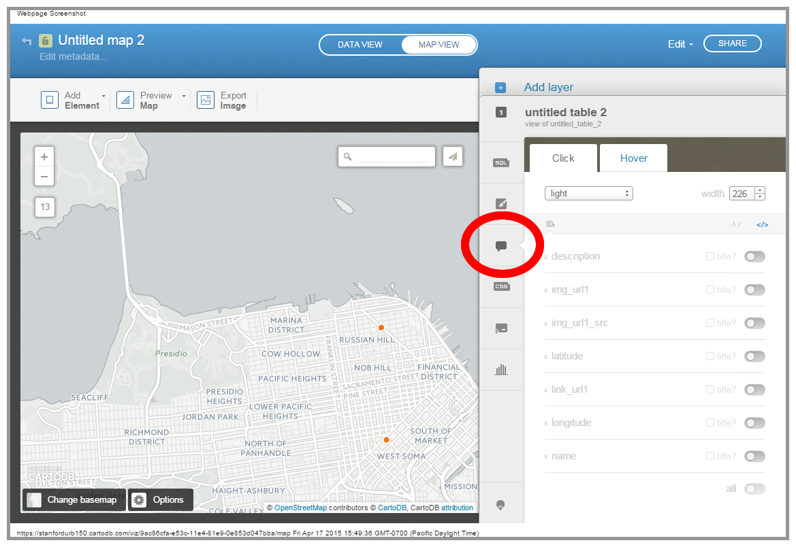

* Click on the **header** dropdown and select the **image header** type


* Use the **switches** to turn on all but the **latitude** & **longitude** fields for display in the pop-up
* Toggle all of the **title** checkboxes **off**
* **Drag-and-Drop** the enabled fields to reorder them so that they are ordered like so:
 * **name**
 * **description**
 * **link_url1**
* Now, click on the **Change HTML** link at the top right of the Cick pop-up panel


* Find the following code:
>      <h1 class="order1">{{description}}</h1>

    And replace it with:
>      <h1 class="order1">{{name}}</h1>

    and click **Apply**

This should change the text in the pop-up header to the **name** value you put in the corresponding column.

* Find the following code:

```
	{{link_url1}}</p>
```

* And replace it with:

```
	<a href="{{link_url1}}" target="_blank"'>More Information</a>
```

* and click **Apply**


###A Little More Work
You can customize your CartoDB map a bit more, now, using the **Options** button, etc... I suggest at least setting the options for **Scroll Wheel Zoom**.

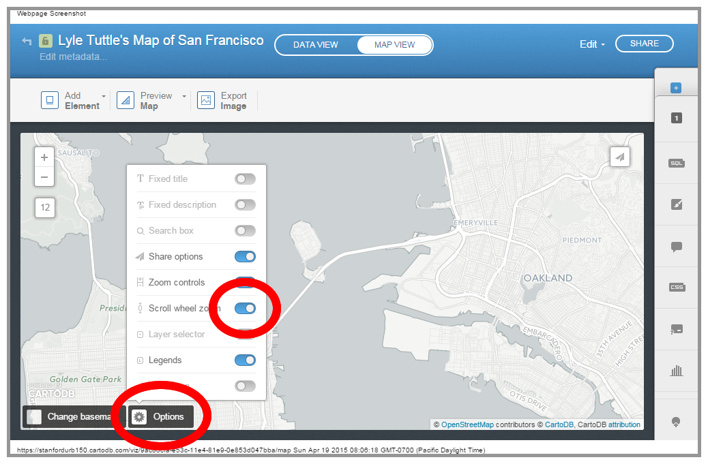

That's it! We're now ready to switch gears to create a Story Map with **Odyssey.js**

You can find my Tattoo map at: http://cdb.io/1FXtGQ9 
##Creating a Story Map with Odyssey.js

Now that you've created the data for your story map, you're ready to go and build the narrative/navigation part of your application. We're going to use Odyssey.js for this. Odyssey.js is actually a JavaScript library that you can use on your own web  server, but CartoDB has implemented a **Sandbox** that allows non-programmers to deploy a story map with very little coding and without any web server infrastructure, at all. Odyssey.js uses a very simple text matkup language called **Markdown**. This entire tutorial is actually written in **Markdown**, which allows Github to render the lists, HTML links and other elements. 

###Choosing an Odyssey.js Template

* First, go to http://cartodb.github.io/odyssey.js/ and click on the 

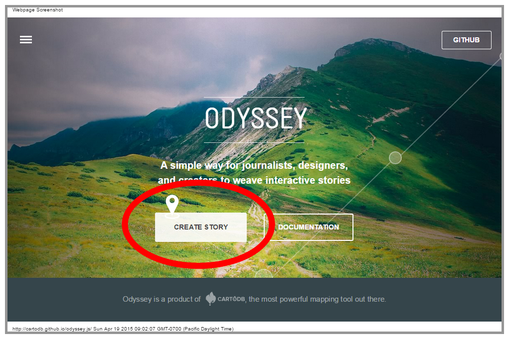

* Now, **select** the **Slides Template**

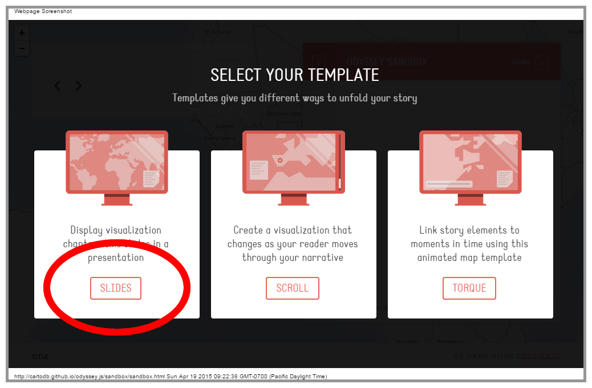

You should now see the **Odyssey.js Sandbox** template for a slideshow style story map. Note that you will be editing in the panel labeled **Odyssey Sandbox** and your edits will change the look of the content panel on the left, as well as the map. The **Odyssey Sandbox** panel will not be visible in the final story map.

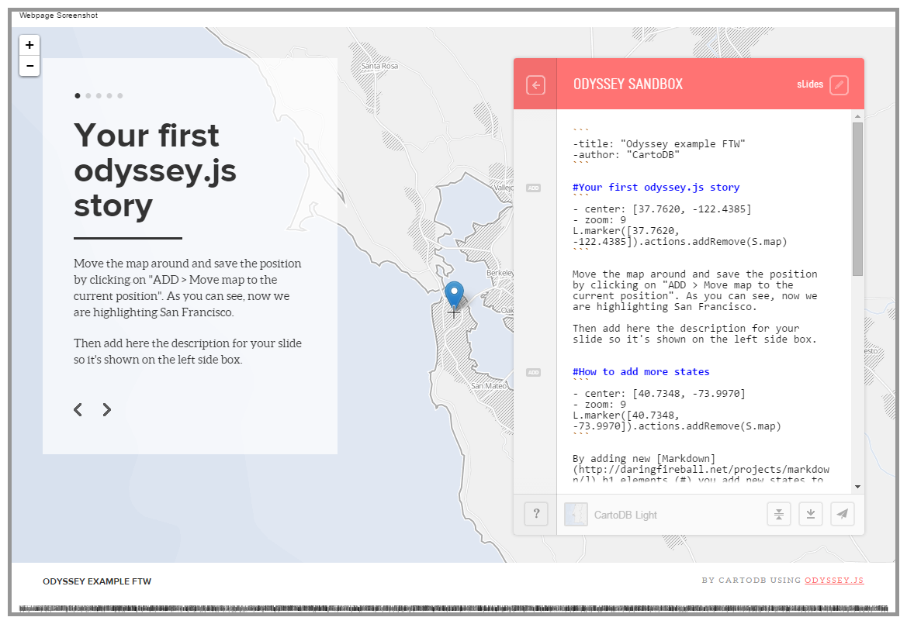

###Customize the **config block** of Your Odyssey.js Applicaiton

* At the top of the *Oddysey Sandbox** panel, you should see two lines of text that look like this:
```
	```
	-title: "Odyssey example FTW"
	-author: "CartoDB"
	```
```

* Go ahead and customize it so that it reflects the **title** and **author** for your project:
```
    ```
    -title: "The Tattoo Map of San Francisco"
    -author: "Stace Maples"
    ```
```

###Bringing your CartoDB Visualization into Odyssey.js 

The first thing we want to do is bring the **CartoDB Visualization** we created into the Odyssey.js application. We're going to use the **[vizjson](http://cartodb.github.io/odyssey.js/documentation/#optional-options)** option in the **[config block](http://cartodb.github.io/odyssey.js/documentation/#config-block)** of your Odyssey.js markdown. First, you will need the JavaScript API URL of your visualization.

* Return to the CartoDB page for your visualization and click on the **Share** button

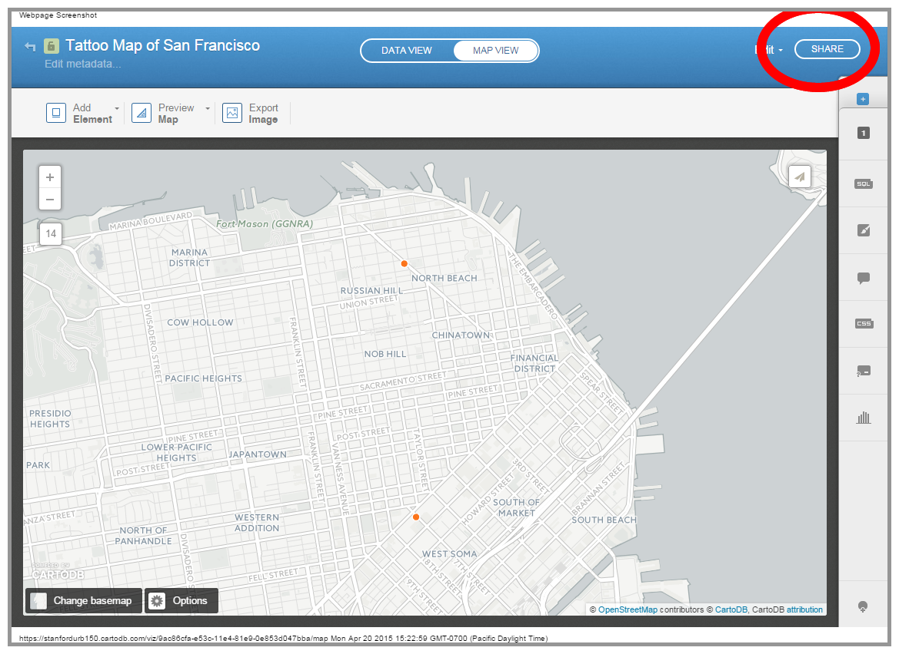

* Click on the **Copy** button under the CartoDB.js panel to copy your CartoDB.js API URL

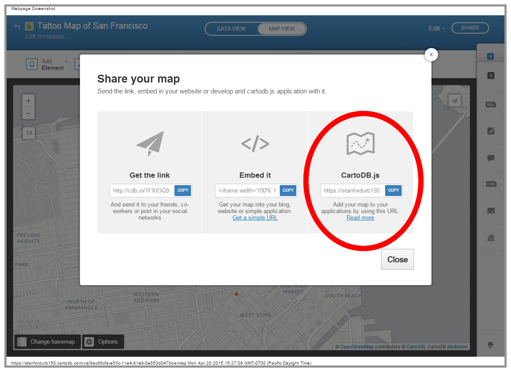

* Return to the **Odyssey Sandbox** and paste '**vizjson: "*Your CartoDB.js API URL*"**' with your **CartoDB.js API URL** into the **config block**, so that it now looks something like this:

```
    ```
    -title: "The Tattoo Map of San Francisco"
    -author: "Stace Maples"
    -vizjson: "https://stanfordurb150.cartodb.com/api/v2/viz/9ac86cfa-e53c-11e4-81e9-0e853d047bba/viz.json"
    ```
```

Note that the data points from your CartoDB visualization should now be visible in your map.


###Adding a Slide to Your Story Map

Now you're ready to start adding the content of your slides to the Oddysey.js Sandbox. Now is a good time to review a little bit about the Markdown language that drives the Odyssey.js application. As mentioned above, [Markdown](http://daringfireball.net/projects/markdown/syntax) is a text markup language that acts a bit like shorthand for writing HTML code. Markdown simplifies the process of creating HTML text formatting, add ing images, links and other content to a page meant for the web. This entire tutorial is written in [Markdown](http://daringfireball.net/projects/markdown/syntax). 
Odyssey.js uses [Markdown](http://daringfireball.net/projects/markdown/syntax) in thhe way it is intended (to format text and content) with one important exception. The **H1 Heading** element is used by Odyssey.js to signal the beginning of a "new slide." You can see this in the **Odyssey.js Sandbox** if you count the number of **dots** at the top of the content panel on the left, and then count the number of lines in the ODYSSEY SANDBOX panel on the right that begin with the **\#** symbol. Same number! Each **H1 Header** line in the Sandobox define the begining of a new slide, as well as the Title text of that slide.

####Here are a few more important bits of [Markdown](http://daringfireball.net/projects/markdown/syntax) syntax:
###Headers

    # Level 1 (H1) Header, also indicates the beginning of a new slide in Odyssey.js
    ## Level 2 Header
    ### Level 3 Header
And will render like this:
# Level 1 (H1) Header, also indicates the beginning of a new slide in Odyssey.js
## Level 2 Header
### Level 3 Header

###Paragraph Text
	Paragraph text is just paragraph text. You can **bold** text or use *italics*. Those are the most common uses and they end up looking like this:
Paragraph text is just paragraph text. You can **bold** text or use *italics*. Those are the most common uses and they end up looking like this.
### Lists

    1. This
    2. Is
    3. An
    4. Ordered
    5. List

    * This
    * Is
    * A
    * Bullet
    * List
Which renders like this:  
1. This  
2. Is  
3. An  
4. Ordered  
5. List
  
* This
* Is
* A
* Bullet
* List


### Links

    Create Links like this: [Google](http://google.com)

Which Renders like this:
[Google](http://google.com)

###Images
    You can place an image like this: 
	
	

Which will render like this:


That's as far as we are going to dive into Markdown for this tutorial, but there is loads more you can do with it. If you want' to find out more, go to [http://daringfireball.net/projects/markdown/syntax](http://daringfireball.net/projects/markdown/syntax)

##Making Your First Odyssey.js Slide

Ok, time to create your first Story Map slide. 
* Return to the **Odyssey Sandbox** and place your curser on the blank line just above the deafult first slide **H1** header and add the **Title Text** you want for your first slide, like this:

```
    #Lyle Tuttle's First Tattoo Shop
```

* Hit **Enter**
* Now position the map so that the *crosshair* in the center of the screen is directly above the location you want to highlight. Use the **Zoom** tool to change the scale of the map, until you are happy with the view.
* Notice that when you created the **H1** header for your slide, a little **ADD** button appeared to the left of it in the **Odyssey Sandbox**. Click on that **ADD** button to snapshot the view for the slide. Select the option to ***move map to the current position***.

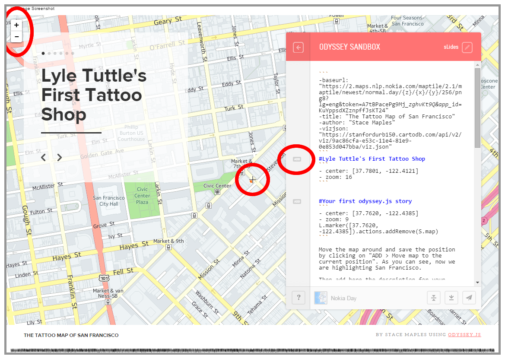

###Add more slides!
Now that you know how, you can delete the **Sandbox** Markdown below your first slide and add all of the slides you want! Insert Images, etc...

##Using a Georeferenced Map from [DavidRumsey.com](http://www.davidrumsey.com/view/georeferenced-maps) as Your Basemap

It's possible to change the basemap of your **Odyssey.js** Story Map, either using the Basemap Selector at the bottom of the **Sandbox** panel, or by adding a bit of code to the **config block**. This is a bit tricky, but I will briefly explain it here.

* First, go to [DavidRumsey.com](http://www.davidrumsey.com/view/georeferenced-maps) and find a map that is georeferenced that you can use (I won't go into the use of his georeferencer here, but you can search for any map you want and georeference it yourself). There is a **Map Finder** at the bottom of the page, which is currently the easiest way to locate a map for the area you want.
* Click on the dots to preview the maps, and once you find one, click on **View this map in... *Georeferencer***


* Click on the **Embed OGC WMTS tiles** link at the top right of the map window

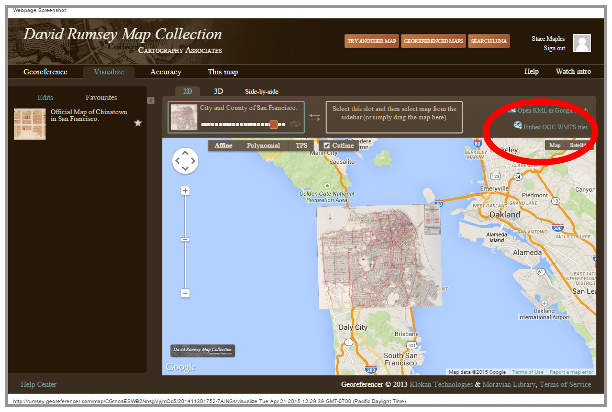

* Click on the **Affine Thumbnail**  

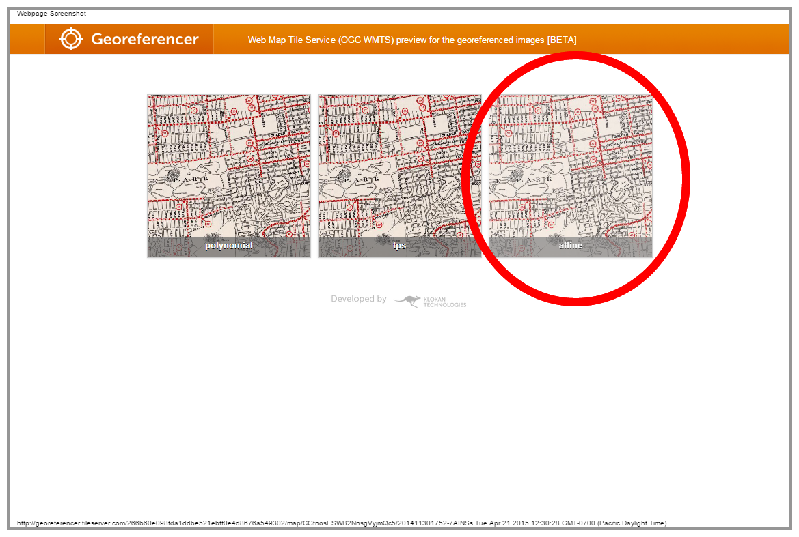

* Find the *MapBox JS** Source code link on the right side of the page and click on it


* OK, here's the tricky part. It looks scarier than it is. Find the first URL for the Tile Server in the code. It should be **Green**. Highlight & copy that URL, with the quotes. It will look something like this:  
```
	"http://georeferencer-0.tileserver.com//266b60e098fda1ddbe521ebff0e4d8676a549302/map/CGtnosESWB2NnsgVyjmQc5/201411301752-7AINSs/affine/{z}/{x}/{y}.png"
```
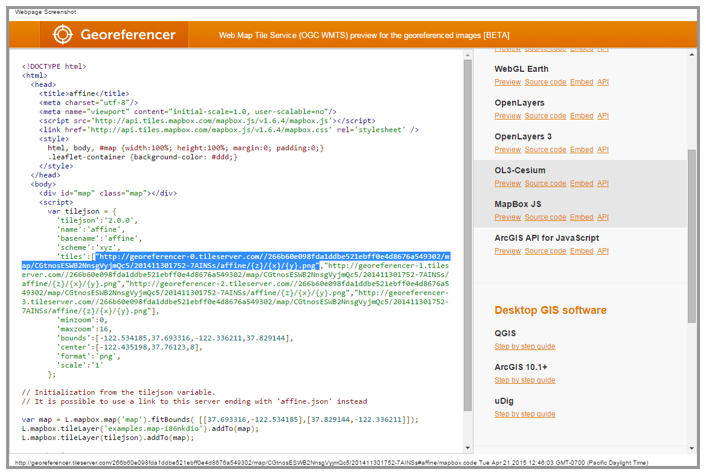

* Return to your **Odyssey.js Sandbox** and add the following text to your **config block** at the top of your Markdown code, using the URL you copied from davidrumsey.com, like this:  

```
	-baseurl: "http://georeferencer-0.tileserver.com//266b60e098fda1ddbe521ebff0e4d8676a549302/map/CGtnosESWB2NnsgVyjmQc5/201411301752-7AINSs/affine/{z}/{x}/{y}.png"  
```


#Here is the Markdown Code for the Sample Story Map I Just Walked Through, Above:
```
	```
	-baseurl: "http://georeferencer-0.tileserver.com//266b60e098fda1ddbe521ebff0e4d8676a549302/map/CGtnosESWB2NnsgVyjmQc5/201411301752-7AINSs/affine/{z}/{x}/{y}.png"
	-title: "The Tattoo Map of San Francisco"
	-author: "Stace Maples"
	-vizjson: "https://stanfordurb150.cartodb.com/api/v2/viz/9ac86cfa-e53c-11e4-81e9-0e853d047bba/viz.json"
	```
	#The Tattoo Map of San Francisco
	```
	- center: [37.7687, -122.4355]
	- zoom: 13
	```
	The History of American Tattooing and the City of San Francisco have an intimate relationship. This map explores that relationship. It is by no means authoritative, or comprehensive. Slides and information will be added, over time.

	#Lyle Tuttle's First Tattoo Shop
	```
	- center: [37.7801, -122.4121]
	- zoom: 16
	```
	

	Tuttle was born in Chariton, Iowa in 1931 but grew up in Ukiah, California. At the age of fourteen he purchased his first tattoo for $3.50. In 1949, he began tattooing professionally.[2] In 1954 he opened his own studio in San Francisco. This first shop was open for nearly 30 years. Tuttle tattooed Janis Joplin, Cher, Henry Fonda, Paul Stanley, Joan Baez, the Allman Brothers, and many other notable musicians, actors, and celebrities.

	#Lyle Tuttle's Tattoo Museum and Studio
	```
	- center: [37.8024, -122.4135]
	- zoom: 17
	```
	

	His first shop when working for Bert Grimm at 16 Cedar Way, Long Beach, CA. on "The Pike". After tattooing in Anchorage and Fairbanks, AK. and Oakland, CA., Lyle opened up shop in 1960 at #30 7th St., in between Mission St. and Market St., also referred to as South of Market, San Francisco, CA. As the story goes, the end of an era and the beginning of a new one. Lyle tattooed at #30 7th St., San Francisco, CA. for 29 and a half years, until the Loma Prieta Earthquake in 1989 caused the building to be "yellow tagged". The shop and the museum are both now open at 841 Columbus Avenue.

```


