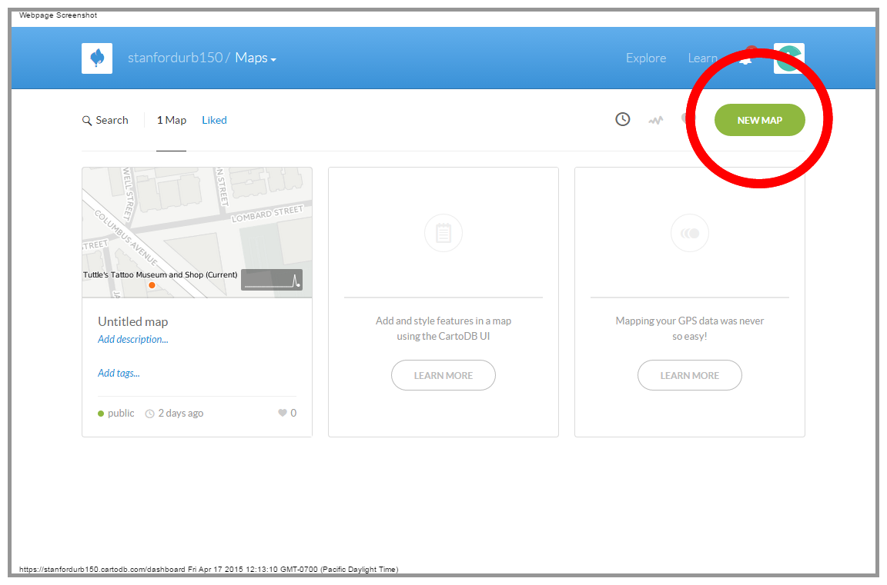
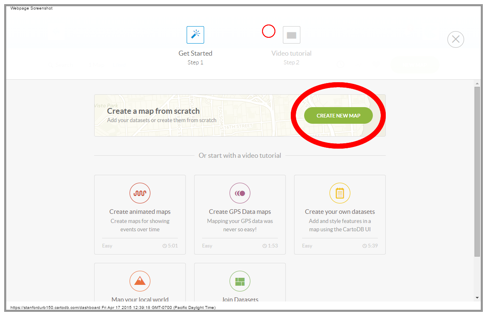
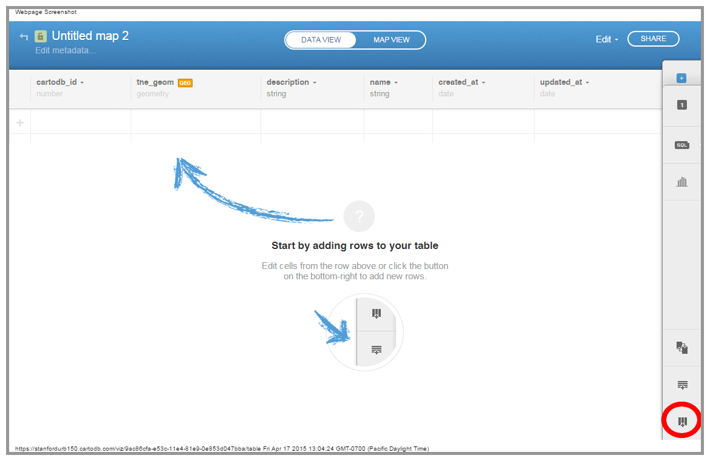
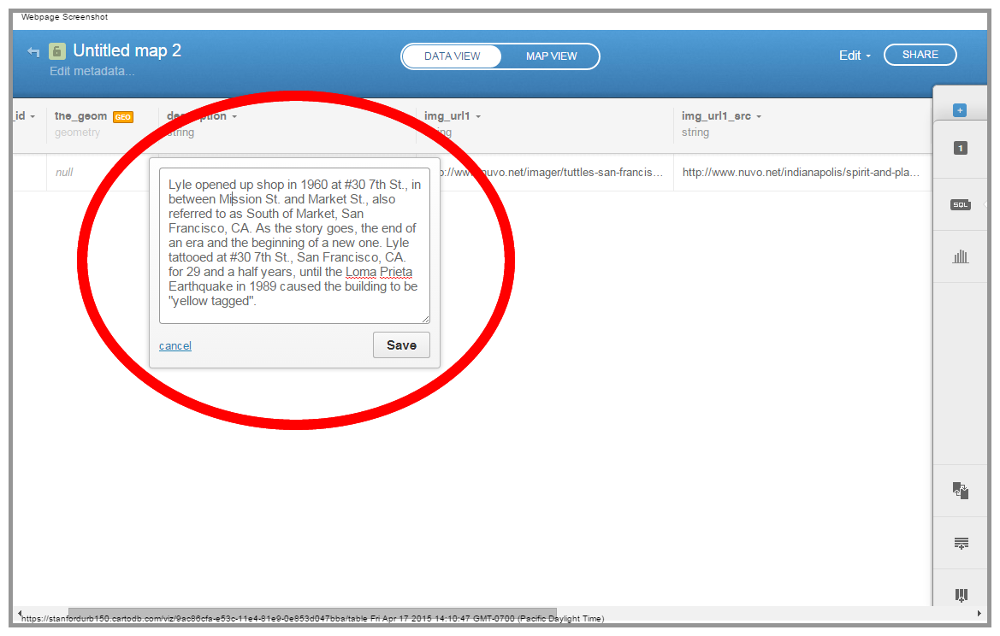
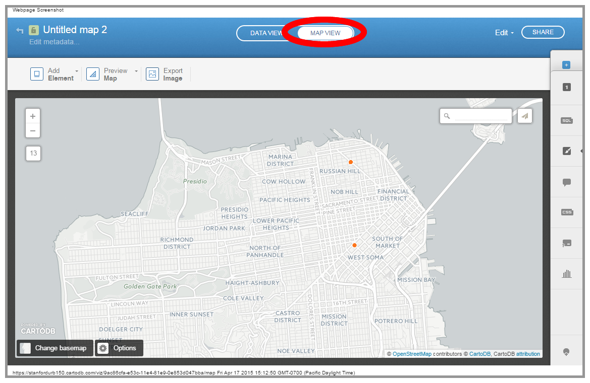
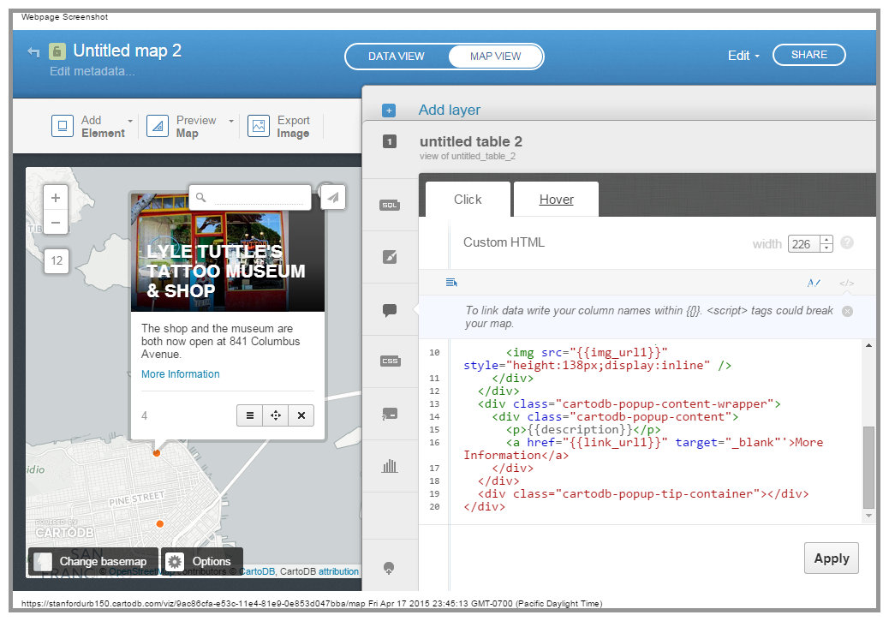

#Using CartoDB and Odyssey.js for Making Story Maps
This tutorial has been written so that it is generic enough for anyone to easily create a story map using a free CartoDB account and Odyssey.js. The tutorial is written specifically to support a course at Stanford University, but is being made publicly available for the benefit of all. We like the [FOSS4G](https://2015.foss4g-na.org/) ethos, here, and try to live it. 

I'll be maching up information from various sources ([Wikipedia](http://www.wikipedia.org), etc...) on the modern history of tattooing in San Francisco. Mostly because it's interesting, and there is plenty of material that is cool to look at. That said, I'm not a historian and this is not an authoritative map of that history (now that I think of it, that would be cool though). It's a tutorial on how to make a Story Map from CartoDB and Odyseey.js. 

###In This Tutorial, You Will Learn To:

* Create an empty CartoDB table
* Populate that table with fields for your data
* Add the data to your new empty table
* **'Geocode'** your records so that they show up on the map
* Customize the **Pop-up** and **Hover** doo-dads
* Find your Map ID to put into Odyssey.js
* Use the Odyssey.js 'Sandbox' to create a basic Story Map
* Use an historic map from DavidRumsey.com as a basemap in your Story Map
* Share your Odyssey.js Story Map with a URL, Embed Code, or host it yourself.

###What You Will Need Before Getting Started
* Something interesting to make a Story Map of!
* Information about the locations that make up your story
 * The **Latitude & Longitude** of your locations (Go to [Google Maps](http://maps.google.com), find your location, **right-click** on it and select **What's Here**. You can *cut-&-paste** the coordinates from the resulting info window)

  
 * Links (URLs) to images
 * Links (URLs) to more content
 * Narrative text about your subject
 * etc...
* A **CartoDB account**. You can get a free one, here: [CartoDB Free Account](https://cartodb.com/signup). If you have an **.edu** email address, you can get a slightly better one, here: [CartoDB Aademy Account](https://cartodb.com/signup?plan=academy)

###It Would Be Incredibly Helpful if You...
* Go through the following [CartoDB Academy courses:](http:/academy.cartodb.com/) 
 * [Online Mapping for Beginners](http://academy.cartodb.com/courses/01-beginners-course.html#) - Basic concepts of online mapping
 * [Introduction to Map Design](http://academy.cartodb.com/courses/02-design-for-beginners.html) - Master the basics of designing data for your maps!
* Learn more about [MarkDown](http://daringfireball.net/projects/markdown/), which is the text editing 'language' you will use to create the content in your Odyssey.js Story Map (It's also what this tutorial is written in!).
* Take a look at these pages from the w3schools.com:
 * [HTML img Tag](http://www.w3schools.com/tags/tag_img.asp) - We'll use this to turn our image URL into the image in our pop-ups
 * [HTML a Tag](http://www.w3schools.com/tags/tag_a.asp) - We'll use this to turn our Link URLs into actual links in our pop-ups

##Getting Started with CartoDB
* Login to your CartoDB Account (if you don't have one, see above).

###Create an Empty Map/Dataset
* Click on the **New Map** Button.

* Click on the **Create New Map** button

* Click on your **untitled_map** to highlight it and then click the **Create Empty Map** link at the top right of the page

* Click on yet another **Create Map** button...

###Adding Fields to an Empty CartoDB Table

You should now see something like the image, above, with a basic CartoDB Basemap and the tools you need to begin building your map. You should have already gone through the CartoDB Academy Basic courses, so we won't go through all of the details, now. We're going to get right to work creating fields to hold our content. Let's get started...

* Click on the **Data View** button at the top of the page...

* CartoDB will tell you to start adding rows, but we're not ready for that, yet. First, we want to add some columns to hold the content we want in our pop-ups and hoveer actions. Click on the **Add Columns** button, instead...

* Our blank table already has **description** and **name** fields, so we don't need to add those. We *do* want to add images to our pop-ups, as well as links our image sources and maybe even links to other websites with more information on the subject of the points we input. Let's add columns for those...

Add the following columns using the **Add new column** dialog box (just click the **Add Column** button again for each one):
* **'img_url1'** with a type of **'string'** (this will hold the URL for the image you want to show up in your pop-up)
* **'img_url1_src'** with a type of **'string'** (to hold the URL of the website you got the image from)
 * If you want more than one image per pop-up, just add more sets of **'img_url#'** and **'img_url#_src'** columns, iterating the number (not too many, though, you'll be able to insert images into the narrative text of your Odyssey.js Story Map)
* **'link_url1'** with a type of **'string'** (This will hold a URL to link out to other sources of information)
 * Again, if you want more links, just iterate the **'link_url#'** column
* **'latitude'** with a type of **'number'**
* **'longitude'** with a type of **'number'**

##Entering Your Data!
Now it's time to start putting some content into your CartoDB table. Hopefully, you've already assembled the materials you need and can simply begin to **cut-&_paste** that data into your table.

* First, click on either of the **Add Row** buttons at the left side of the first empty row, or at the bottom right of the table, right above the *Add Column** button.

* Now simply **double-click** in the **cell** you want to edit and **cut-&-paste** the data for your locations into the table.

**Now all you need to do is repeat the process for all of your locations!**

###Geocoding Your Locations (making them show up on the map)
Once you have finished entering all of your data, you need to tell CartoDB that your **'latitude'** & **'longitude'** fields contain the geographic information about your locations. This will create **geometry** data in the default column, **'the-geom'**.
* Click on the orange **GEO** button, to the right of the name of the **'the_geom'** column

* CartoDB should guess that your coordinate columns are called **'longitude'** & **'latitude'**
* Click **Continue**

>You may have noticed that we could have simply placed **street addresses** into our table and **'geocoded'** our data that way. We used **coordinate** for two reasons:
>* First, **geocoding street addresses** in CartoDB comes with a quota, **geocoding** with **coordinates** doesn't...
>* Second, we're mapping historical locations/addresses that might not necessarily be the same, now, as they were, historically. Streets change names, disappear and are created through time.

* That's it! You should see your coordinates in the **'the_geom'** column, now!
* Click on the **MAP VIEW** button at the top and center of the page to see your locations appear on the map.

Ok. You've got a CartoDB map, now. We're not going to go into creating custom symbols, etc... since you can just go the the **CartoDB Academy** page (see the top of this page) and get all of that. We're just going to stick with the default symbol for this tutorial.

###Customizing the Click & Hover Pop-ups

Now we want to do a little culstomization of the pop-ups that will appear when you click or hover on the points in your map. Notice that, right now, nothing happens when you hover over a point, and you get a message that ***"You haven’t selected any fields to be shown in the infowindow."*** when you click on a point. Now is time to fix that, but we're going to go beyond just showing the fields we've entered, since they are just **URLs** and not terribly interesting. 

* Click on the **infowindow** button to open the CartoDB control panel at the right side of the page. 

* Click on the **header** dropdown and select the **image header** type

* Use the **swithes** to turn on all but the **latitude** & **longitude** fields for display in the pop-up
* Toggle all of the **title** checkboxes **off**
* **Drag-and-Drop** the enabled fields to reorder them so that they are ordered like so:
 * **name**
 * **description**
 * **link_url1**
* Now, click on the **Change HTML** link at the top right of the Cick pop-up panel

* Find the following code:
>      <h1 class="order1">{{description}}</h1>

    And replace it with:
>      <h1 class="order1">{{name}}</h1>

    and click **Apply**

This should change the text in the pop-up header to the **name** value you put in the corresponding column.

* Find the following code:
>                  
{{link_url1}}

    And replace it with:
>      <a href="{{link_url1}}" target="_blank"'>More Information</a>

    and click **Apply**

###A Little More Work
You can customize your CartoDB map a bit more, now, using the **Options** button, etc... I suggest at least setting the options for **Scroll Wheel Zoom**.

That's it! We're now ready to switch gears to create out Story Map with **Odyssey.js**
##Creating a Story Map with Odyssey.js

